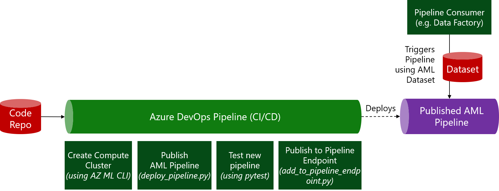

# Exercise Instructions

In this execise, we'll deploy a DevOps pipeline that will enable the following scenario:


## Import `deploy-simple-pipeline-with-tests.yml` pipeline

This DevOps pipeline is used to the automatically deploy and test the Python-based ML training pipeline we've created in one of the earlier exercises.

1. Select `Pipelines --> Pipelines` (rocket icon) and select `New pipeline`
1. (Connect step) - Choose `Azure Repos Git`
1. (Select step) - Select your repo (there should only be one named after your project)
1. (Configure step) - Select `Existing Azure Pipelines YAML file` and choose the path to the file `/devops-deploy-pipeline-with-tests/deploy-simple-pipeline-with-tests.yml`
1. In the upcoming preview window, update the `variables` section (if you've used the defaults, this should not require any changes): 
  ```yaml
  variables:
    resourcegroup: 'aml-mlops-workshop' # replace with your resource group (same as you've used for the Service Connection)
    workspace: 'aml-mlops-workshop' # replace with your workspace name (same as you've used for the Service Connection)
    aml_compute_target: 'cpu-cluster'
  ```
1. Review the YAML file, this CI/CD pipeline has nine key steps (first six are the same as in the prior exercise):
    * Set Python version on the build agent
    * Install Azure Machine Learning CLI (primarily used for authentication to workspace in this example)
    * Attach folder to workspace for authentication
    * Create the AML Compute target
    * Publish pipeline for model training
    * Run a test dataset through the pipeline using `pytest`
    * Publish the test results
    * Add tested pipeline to a pipeline endpoint, so that the URL of the pipeline stays the same
1. Select `Run` to save and run the pipeline.

Lastly, navigate to the AML Studio UI and you should fine your pipeline under `Endpoints -> Pipeline Endpoints` (same as before). Once your pipeline finished, you can also investigate the test results. For this, goto the pipeline, select the run, and then select the `Tests` tab (next to the `Summary` tab).

# Knowledge Check

:question: **Question:** Why do we need a service connection?
<details>
  <summary>:white_check_mark: See solution!</summary>

The service connection connects Azure DevOps to the resource group where our Workspace resides in, and therefore gives this connection full control to execute commands in AML.
</details>

:question: **Question:** Why do we use `az ml folder attach -w $(workspace) -g $(resourcegroup)`?
<details>
  <summary>:white_check_mark: See solution!</summary>

This command associates our repo (on the build agent) with our workspace. This allows subsequent Python code just call `ws = Workspace.from_config()` to authenticate and connect to the workspace.
</details>
