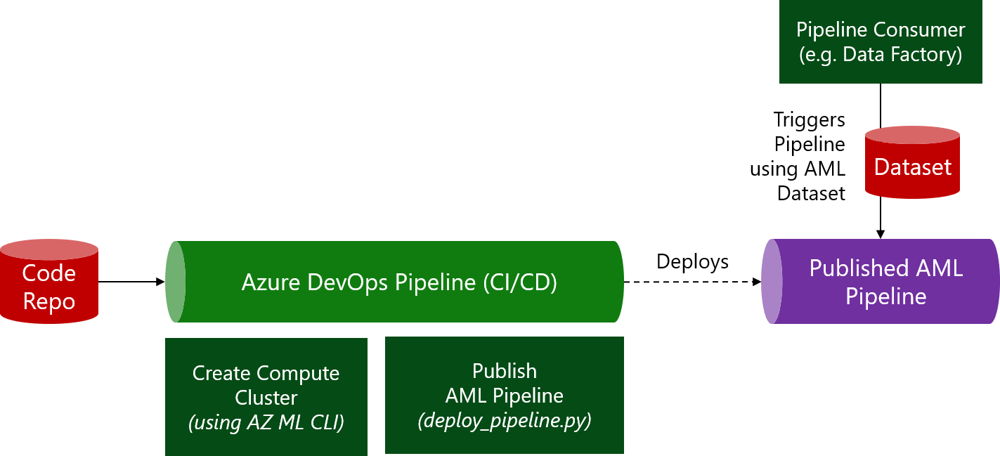

# Exercise Instructions

In this execise, we'll deploy a DevOps pipeline that will enable the following scenario:


## Create a new Azure DevOps project

1. Sign in to [Azure DevOps](http://dev.azure.com)
1. Select `Create project` (you can keep it private)
1. Provide Project Name: `aml-mlops-workshop-123` (or something else) and select `Create`

## Import the workshop repo

Next, we'll clone the workshop repo into the project's "local" repo:

1. Goto Repos, then select `Import a repository`
1. Enter the `Clone URL`: `https://github.com/csiebler/azure-machine-learning-mlops-workshop` and import it

## Create new Service Connection in Azure DevOps

Next, we'll authenticate from Azure DevOps to AML, so that Azure DevOps can make calls to AML on our behalf.

1. From the left navigation select `Project settings` (at the bottom, the gear icon) and then select `Service connections`
1. Select `Create service connection` and then select `Azure Resource Manager`
1. Select `Service principal (automatic)`
1. Keep the default `Scope level` to `Subscription`, but update:
   1. Subscription: Select the Azure subscription you've used before
   1. Resource Group: The resource group you've used before
   1. Service connection name: `aml_workspace`
1. Hit `Save`

## Import `deploy-simple-pipeline.yml` pipeline

This DevOps pipeline is used to the automatically deploy the Python-based ML training pipeline we've created in one of the earlier exercises.

1. Select `Pipelines --> Pipelines` (rocket icon) and select `Create pipeline`
1. (Connect step) - Choose `Azure Repos Git`
1. (Select step) - Select your repo (there should only be one named after your project)
1. (Configure step) - Select `Existing Azure Pipelines YAML file` and choose the path to the file `/devops-deploy-simple-pipeline/deploy-simple-pipeline.yml`
1. In the upcoming preview window, update the `variables` section (if you've used the defaults, this should not require any changes): 
  ```yaml
  variables:
    resourcegroup: 'aml-mlops-workshop' # replace with your resource group (same as you've used for the Service Connection)
    workspace: 'aml-mlops-workshop' # replace with your workspace name (same as you've used for the Service Connection)
    aml_compute_target: 'cpu-cluster'
  ```
1. Review the YAML file, this CI/CD pipeline has six key steps:
    * Set Python version on the build agent
    * Install Azure Machine Learning CLI (primarily used for authentication to workspace in this example)
    * Attach folder to workspace for authentication
    * Create the AML Compute target
    * Publish pipeline for model training
1. Select `Run` to save and run the pipeline.

Lastly, navigate to the AML Studio UI and you should fine your pipeline under `Endpoints -> Pipeline Endpoints`. Imported Azure DevOps Pipelines always have weird names, so you can select the pipeline, then click the three dots `...` (upper right corner of the UI), and select `Rename`.

# Knowledge Check

:question: **Question:** Why do we need a service connection?
<details>
  <summary>:white_check_mark: See solution!</summary>

The service connection connects Azure DevOps to the resource group where our Workspace resides in, and therefore gives this connection full control to execute commands in AML.
</details>

:question: **Question:** Why do we use `az ml folder attach -w $(workspace) -g $(resourcegroup)`?
<details>
  <summary>:white_check_mark: See solution!</summary>

This command associates our repo (on the build agent) with our workspace. This allows subsequent Python code just call `ws = Workspace.from_config()` to authenticate and connect to the workspace.
</details>
