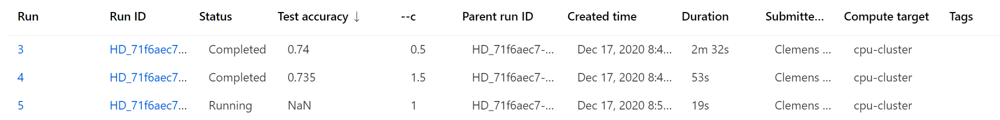

# Exercise Instructions

Open [`hyperdrive_pipeline.ipynb`](hyperdrive_pipeline.ipynb) and follow the instructions in the notebook.

# Running this via CLI

You can also run the Hyperdrive Hyperparameter Tuning via CLI:

```console
az ml folder attach -w <YOUR WORKSPACE NAME> -g <YOUR RESOURCE GROUP>
az ml run submit-hyperdrive --hyperdrive-configuration-name hyperdrive_config.yml -c hyperdrive -e hyperdrive-test
```

In this case:
* [`hyperdrive_config.yml`](hyperdrive_config.yml) holds the configuration for the hyperparameter tuning. Full details on the parameters can be found [here](https://docs.microsoft.com/en-us/azure/machine-learning/how-to-tune-hyperparameters#define-the-search-space)
* [`hyperdrive.runconfig`](hyperdrive.runconfig) holds the general script definition (which dataset, cluster, etc.)
* [`train.py`](train.py) takes all the hyperparameters as argument inputs

You can check the results in the Studio UI (navigate to the run, then select `Child Runs`):



Each Hyperparameter permutation will be executed in its own child run.

# Knowledge Check

To be written